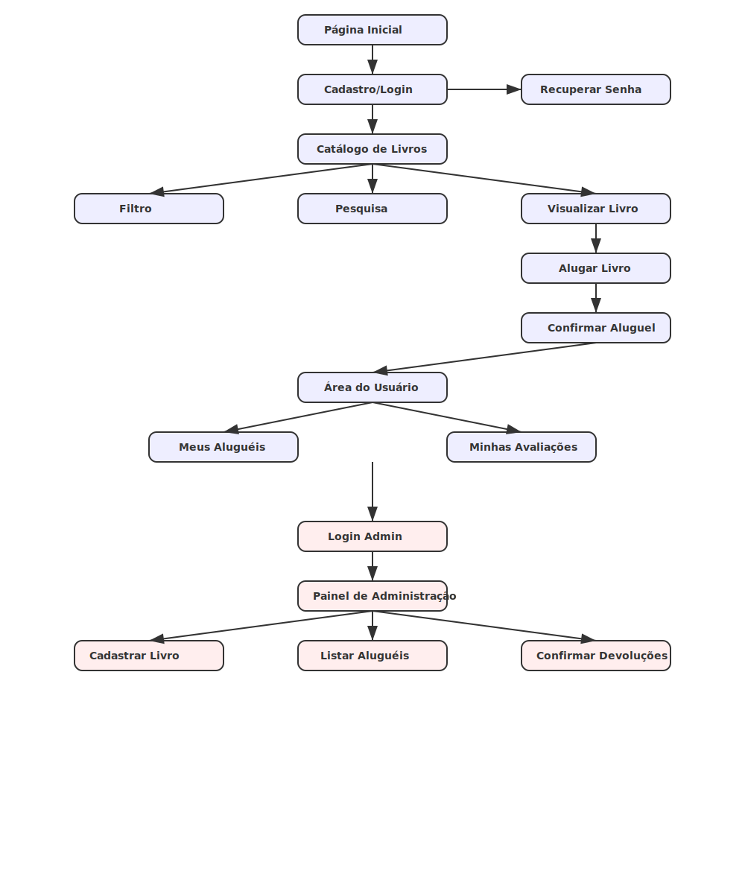

# 📖 BookWave - Sistema de Locadora de Livros Online

# 📚 BookWave
_"Leia onde quiser, quando quiser!"_

Bem-vindo ao projeto da **BookWave**, uma locadora de livros online que proporciona uma experiência simples, prática e eficiente para os amantes da leitura.

Este documento contém todas as **regras de negócio** necessárias para o desenvolvimento do sistema.

---

## 🎯 Objetivo

Permitir que usuários possam:
- Navegar no catálogo de livros disponíveis.
- Alugar livros físicos ou digitais.
- Acompanhar seus aluguéis.
- Avaliar livros.
- Administradores possam gerenciar o acervo e as locações.

---

## 🔥 Funcionalidades Principais

- Cadastro e login de usuários.
- Catálogo de livros com filtros e pesquisa.
- Visualização de detalhes do livro.
- Aluguel de livros com controle de disponibilidade.
- Área do usuário para gerenciar seus aluguéis.
- Administração do catálogo e controle de devoluções.

---

## 🧩 Fluxo Geral do Sistema

1. **Página Inicial**  
   Exibe destaque de livros e acesso ao catálogo.

2. **Cadastro/Login de Usuários**  
   - Cadastro de novos usuários com dados obrigatórios: Nome, Email, Telefone, Endereço, Data de Nascimento e Senha.
   - Login de usuários registrados.
   - Recuperação de senha.

3. **Catálogo de Livros**
   - Listagem de livros disponíveis com opção de filtrar e buscar.
   - Exibição de capa, título, autor e status de disponibilidade.
   - Botão para iniciar aluguel.

4. **Detalhe de Livro**
   - Exibe informações completas: capa, nome, autor, tipo (físico/digital), disponibilidade e nota de avaliação.
   - Botão para alugar livro.

5. **Processo de Aluguel**
   - Confirmação do aluguel.
   - Aplicação de regras:
     - Prazo padrão de aluguel: **15 dias**.
     - Permite **1 renovação** por livro alugado.
     - Caso o prazo expire, o usuário deve **pagar multa** antes de novo aluguel.

6. **Área do Usuário**
   - Visualizar todos os livros alugados.
   - Ver prazos e status de aluguel.
   - Renovar aluguel (uma vez por livro).
   - Devolver livro.
   - Pagar multa se aplicável.
   - Avaliar livros alugados.

7. **Administração (restrita a usuários administradores)**
   - Login administrativo separado.
   - Cadastro de novos livros no catálogo (nome, autor, tipo, gênero, imagem de capa).
   - Listagem e gerenciamento dos aluguéis em andamento.
   - Confirmação de devoluções de livros.

---

## 🛡️ Regras de Negócio

- Um livro só pode ser alugado se estiver **disponível**.
- Um usuário pode ter **vários livros alugados** simultaneamente, desde que sem pendências (multa ou devolução atrasada).
- Cada aluguel:
  - Dura **15 dias** inicialmente.
  - Pode ser **renovado uma única vez** por mais **15 dias**.
- Após vencimento do prazo:
  - Usuário deve pagar multa para continuar alugando.
- Livro alugado deve mudar seu status para **indisponível** no catálogo.
- Administradores podem:
  - Confirmar devoluções e tornar livros disponíveis novamente.
  - Cadastrar e editar informações dos livros.
- Sistema deve manter **histórico de avaliações** dos livros.

---

## 📄 Estrutura Básica de Telas

- Página Inicial
- Tela de Login/Cadastro
- Catálogo de Livros
- Página de Detalhe de Livro
- Página de Aluguel
- Área do Usuário (Meus Aluguéis / Minhas Avaliações)
- Área do Administrador (Painel de Controle)

---

## ✍️ Observações Finais

- O sistema deverá ser responsivo para funcionar em desktop e dispositivos móveis.
- Interface focada em usabilidade simples e direta.
- Priorizar a segurança dos dados dos usuários (como senha criptografada).

---

# 🛤️ Fluxo de Telas

# 📑 Wireframe (Protótipo Visual Simples)

Este documento descreve os wireframes (protótipos visuais simples) das páginas principais do projeto **BookWave**. O objetivo é fornecer uma representação básica e visual das funcionalidades e estrutura das telas.

---

## Páginas

### 1. **Página Inicial**
----------------------------------------------------
| LOGO BookWave        | [Login] [Cadastro]        |
----------------------------------------------------
| **Banner**: "Leia onde quiser, quando quiser!"   |
| [Ver Catálogo] (botão grande)                    |
----------------------------------------------------
| **Seção: Destaques**                             |
| [Livro 1] [Livro 2] [Livro 3] [Livro 4]         |
----------------------------------------------------
| **Footer**                                        |
----------------------------------------------------

---

### 2. **Tela de Cadastro/Login**
---------------------------------------------
| **LOGIN**       | **CADASTRO**                |
| Email: _______  | Nome: ________              |
| Senha: _______  | Email: _______              |
| [Entrar]        | Telefone: _______           |
|                 | Endereço: _______           |
|                 | Data Nasc.: ____            |
|                 | Senha: _______              |
|                 | [Cadastrar]                 |
---------------------------------------------

---

### 3. **Catálogo de Livros**
------------------------------------------------
| [Filtro] [Buscar]                             |
------------------------------------------------
| [Capa Livro] | Nome Livro | Autor | [Alugar]  |
| [Capa Livro] | Nome Livro | Autor | [Alugar]  |
| [Capa Livro] | Nome Livro | Autor | [Indisponível] |
------------------------------------------------
| **Paginação** (1,2,3...)                       |
------------------------------------------------

---

### 4. **Detalhe do Livro**
----------------------------------------
| **Capa do Livro**                        |
| Nome: O Nome do Vento                   |
| Autor: Patrick Rothfuss                 |
| Tipo: Físico                            |
| Disponível: Sim                         |
| Nota: ★★★★☆                             |
| [Alugar este Livro] (botão grande)      |
----------------------------------------
| **Regras do Aluguel**                   |
| - 15 dias de aluguel                    |
| - 1 renovação permitida                 |
----------------------------------------

---

### 5. **Área do Usuário**
--------------------------------------------------
| **Meus Aluguéis**      | [Sair]                  |
--------------------------------------------------
| Livro: Nome Livro                               |
| Prazo restante: 5 dias                         |
| Botões: [Renovar] [Devolver]                   |
--------------------------------------------------
| Livro: Nome Livro                               |
| Prazo expirado!                                |
| Botões: [Pagar Multa]                          |
--------------------------------------------------

---

### 6. **Administração**
--------------------------------------------------
| **Painel de Administração**                     |
| [Cadastrar Livro] [Listar Aluguéis] [Confirmar Devoluções] |
--------------------------------------------------
| **Cadastro de Livro**                           |
| Nome: _____                                    |
| Autor: _____                                   |
| Tipo: ( ) Físico ( ) Digital                    |
| Gênero: ________                               |
| Upload Capa: [Selecionar Arquivo]               |
| [Salvar Livro]                                 |
--------------------------------------------------

---

## Conclusão
Este protótipo serve como uma base visual para o desenvolvimento das interfaces de usuário do **BookWave**. A navegação entre as telas e os elementos básicos já estão definidos, o que facilita a implementação da aplicação real.

